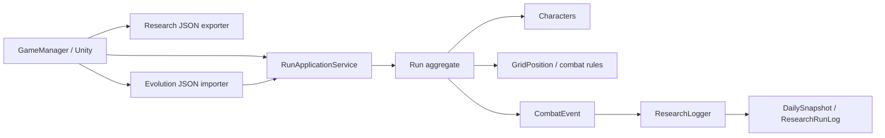

# Hero Defense — Current Project Status

> Checked against commit `85a11b0` (`refactor(core): share character stats across units`).  
> Scope of this document: every C# source file, test file, and Markdown document currently tracked under `Assets/Scripts`, `Tests`, and `Docs`.

## 1. Current State

The project is a playable **Phase 0 pure-C# battle simulation** with Unity presentation adapters. The Unity scene/prefab wiring remains manual, but the domain can create a run, recruit/deploy/rank Heroes, advance battle time, spawn/move Wolves, resolve combat, award end-of-day rewards, record research snapshots, and accept manual external evolution JSON.

Implemented systems:

- 3×3 orthogonal Hero Defense board with City and Spawn gates
- Four Hero classes and Wolf monster
- Standby / Battle / End-of-Day / Lost / Abandoned run lifecycle
- Deterministic per-run seed metadata and replaceable clock/random/scaling contracts
- Daily research logging, board snapshots, lifetime combat totals, and terminal JSON export
- Stat-only manual evolution: validate external JSON, spend development points, apply stat delta atomically, and audit the decision
- Shared `CharacterStats` struct used by Hero and Monster combatants
- Unity adapters for pooling, tiles, character views, spawning, health bars, debug display, research export, and evolution import

Not yet implemented:

- Scene/prefab assignment and final gameplay UI
- Generated/secondary skill selection, Defense, equipment, or skill requirements
- LLM/RL/network integration; external decisions are manual JSON only
- Persistent run save/load repository (current repository is memory only)
- Automated Unity Play Mode tests or a production UI flow

## 2. Runtime Structure



`Run` is the gameplay source of truth. Presentation adapters read it; they do not modify HP, position, combat timing, or evolved stats directly.

## 3. Source Files — Core

### `Assets/Scripts/Core/`

| File | Status and responsibility |
| --- | --- |
| `Types.cs` | Shared enums: run phase, Hero class, event type, skill id, action kind, unit kind, evolvable stat, and evolution source. |
| `Run.cs` | Main aggregate. Owns roster, Wolves, Gold, City HP, day/phase, movement, combat intents, event recording, rank reward, research observer notification, and applied evolution IDs/audits. |
| `RunApplicationService.cs` | Application boundary for run commands, time advance, research-log access, evolution validate/apply, and evolution-request creation. |

### `Assets/Scripts/Core/Characters/`

| File | Status and responsibility |
| --- | --- |
| `Characters/Character.cs` | Abstract combatant. Owns identity, current HP, board position, cooldown and private shared `CharacterStats`; applies stat deltas internally. |
| `Characters/CharacterStats.cs` | Immutable shared `CharacterStats` struct (`MaximumHp`, `AttackDamage`, `AttackInterval`) and additive `CharacterStatDelta` struct. Used by both Hero and Monster. |
| `Characters/Heroes/Hero.cs` | Abstract Hero: class, base skill, rank, survival days, skill slots, development points, and stat-only evolution application. |
| `Characters/Heroes/Soldier.cs` | Concrete Soldier Hero. |
| `Characters/Heroes/Archer.cs` | Concrete Archer Hero. |
| `Characters/Heroes/Mage.cs` | Concrete Mage Hero. |
| `Characters/Heroes/Healer.cs` | Concrete Healer Hero. |
| `Characters/Heroes/HeroFactory.cs` | Creates the correct concrete Hero subclass from `HeroClass`. |
| `Characters/Monsters/Monster.cs` | Abstract Monster: shared character stats plus City damage and movement readiness. |
| `Characters/Monsters/Wolf.cs` | Concrete Wolf monster used by Phase 0 encounters. |

### `Assets/Scripts/Core/Configuration/`

| File | Status and responsibility |
| --- | --- |
| `Configuration/CombatTuning.cs` | Defines `SkillDefinition`, Hero/Wolf tuning records, and Phase 0 balance. Hero/Wolf records now expose the common `CharacterStats` struct. |
| `Configuration/ExponentialEncounterScalingPolicy.cs` | Day monster count formula `ceil(3 × 1.3^(day−1))` and one-second spawn interval. |
| `Configuration/EvolutionPolicy.cs` | Converts valid stat allocations into one `CharacterStatDelta`: HP +5, attack +1, attack interval −0.05 per point; minimum interval is enforced by `CharacterStats`. |
| `Configuration/FixedDevelopmentPointPolicy.cs` | Current balance policy: every successful rank-up grants 5 development points. |

### `Assets/Scripts/Core/World/`

| File | Status and responsibility |
| --- | --- |
| `World/GridPosition.cs` | Value type for 3×3 coordinates; includes City Gate and Spawn Gate constants. |

### `Assets/Scripts/Core/Interfaces/`

| File | Status and responsibility |
| --- | --- |
| `Interfaces/IRunRepository.cs` | Contract to save/find a run. |
| `Interfaces/IRandomSource.cs` | Contract used for deterministic random tie-breaking. |
| `Interfaces/IEncounterScalingPolicy.cs` | Contract for encounter count and spawn interval. |
| `Interfaces/IRunClock.cs` | Replaceable UTC clock contract for run metadata and terminal time. |
| `Interfaces/IRunEventObserver.cs` | Generic observer boundary through which research logging receives immutable combat events. |
| `Interfaces/IDevelopmentPointPolicy.cs` | Contract for rank-to-development-point reward calculations. |

### `Assets/Scripts/Core/Infrastructure/`

| File | Status and responsibility |
| --- | --- |
| `Infrastructure/InMemoryRunRepository.cs` | Session-only repository; no disk persistence. |
| `Infrastructure/SystemRandomSource.cs` | Random source with optional seed constructor. |
| `Infrastructure/SystemRunClock.cs` | UTC system-clock implementation. |

## 4. Source Files — History, Research, and Evolution

### `Assets/Scripts/Core/History/`

| File | Status and responsibility |
| --- | --- |
| `History/CombatEvent.cs` | Immutable append-only event with source/target, value, action kind, skill id, mitigation, and support source context. |
| `History/ExperienceSnapshot.cs` | Legacy compact Hero daily summary retained for compatibility. |
| `History/RunMetadata.cs` | Run ID, seed, start/end UTC timestamps, scenario, game/schema version, and terminal reason. |
| `History/RunStartOptions.cs` | Input values used when a run is created. |

### `Assets/Scripts/Core/History/Research/`

| File | Status and responsibility |
| --- | --- |
| `Research/ResearchLogger.cs` | `IRunEventObserver` implementation. Starts/finishes daily accumulation and attaches Standby decisions to the next battle day. |
| `Research/ResearchRunLog.cs` | Root in-memory research log and per-unit lifetime aggregates. |
| `Research/DailySnapshot.cs` | One battle-day record: preparation, encounter, unit results, board after battle, and post-reward state. |
| `Research/BoardSnapshot.cs` | Snapshot of City, Gold, phase, all units, and every 3×3 room. |
| `Research/UnitStateSnapshot.cs` | Immutable unit view with shared stats, HP, rank, development points, skill, position, and placement. |
| `Research/UnitCombatAccumulator.cs` | Converts combat events into active-day per-unit totals. |
| `Research/UnitCombatResult.cs` | Daily damage/heal/kills/casts/mitigation/support/death outcome per Hero or Monster. |
| `Research/DevelopmentDecision.cs` | Generic recruit/deploy/rank history entry or an attached evolution audit. |

### `Assets/Scripts/Core/History/Evolution/`

| File | Status and responsibility |
| --- | --- |
| `Evolution/CharacterEvolutionDecision.cs` | Method-agnostic external decision, `StatAllocation`, and generic source/experiment metadata. |
| `Evolution/CharacterEvolutionRequest.cs` | Safe observation exported before a decision: unit/run/day, shared current stats, allowed stats, rank, and available development points. |
| `Evolution/CharacterEvolutionValidator.cs` | Validates schema, run/unit/day/phase, alive state, duplicate decision, allocation integrity, points, and stat-only skill rule. |
| `Evolution/CharacterEvolutionService.cs` | Atomic validate-then-apply service. Creates one delta and records an audit only after complete success. |
| `Evolution/EvolutionDecisionResult.cs` | Structured valid/invalid result with code/message/field errors and warnings. |
| `Evolution/EvolutionDecisionAudit.cs` | Before/after stat and development-point state paired with the accepted external decision. |

## 5. Source Files — Unity Game Layer

| File | Status and responsibility |
| --- | --- |
| `Game/GameManager.cs` | Singleton Unity entry point. Creates core dependencies, runs the battle coroutine, exposes commands, exports terminal research logs, and exposes evolution JSON/request APIs. |
| `Game/RunDebugView.cs` | Prototype state/debug display adapter. |
| `Game/Pooling/Pooling.cs` | GameManager-owned component pool; inactive instances are reparented beneath their prefab pool. |
| `Game/Spawning/Spawner.cs` | Builds the visual 3×3 tile grid and mirrors deployed Heroes/positioned Wolves into pooled prefabs. |
| `Game/World/TileView.cs` | Tile prefab component storing board coordinates. |
| `Game/Characters/CharacterView.cs` | Presentation base for binding a core Character. |
| `Game/Characters/HeroView.cs` | Hero presentation component. |
| `Game/Characters/MonsterView.cs` | Monster presentation component. |
| `Game/UI/HealthBarView.cs` | Reusable fill/frame health bar adapter. |
| `Game/History/ResearchJsonExporter.cs` | Unity filesystem adapter that writes terminal logs to `Application.persistentDataPath/research_logs/<run-id>/`. |
| `Game/Evolution/CharacterEvolutionJsonImporter.cs` | Strict JSON v1 parser. Rejects malformed, unknown, or ill-typed external JSON before Core validation. |
| `Game/Evolution/CharacterEvolutionRequestJsonExporter.cs` | Serializes a safe `CharacterEvolutionRequest`, including available points and current `CharacterStats`, for an external decision maker. |
| `Game/Evolution/EvolutionImportDebugPanel.cs` | Optional attachable IMGUI researcher panel with paste, Validate, Apply, and error display. No scene is created automatically. |

## 6. Tests

| File | Current coverage |
| --- | --- |
| `Tests/HeroDefense.Core.Specs/HeroDefense.Core.Specs.csproj` | .NET 8 console test project that links real Core sources plus JSON adapters that do not require Unity. |
| `Tests/HeroDefense.Core.Specs/Program.cs` | Smoke tests for starting roster, Standby restrictions, rank rules, empty-field encounter, research snapshot/closure, evolution atomicity, duplicate prevention, invalid phase/points, JSON parser strictness, shared Hero/Monster stats, and five-point request JSON. |

Run locally:

```powershell
dotnet run --project Tests/HeroDefense.Core.Specs/HeroDefense.Core.Specs.csproj
```

## 7. Existing Documentation

| File | Purpose |
| --- | --- |
| `Docs/core-architecture.md` | Original Phase 0 architecture overview. |
| `Docs/phase-0-class-diagram.md` | Core class hierarchy and diagram. |
| `Docs/phase-0-core-notes.md` | Concise Phase 0 core usage notes. |
| `Docs/unity-adapter-setup.md` | Scene/prefab adapter setup guidance. |
| `Docs/research-logging-architecture.md` | Research logging design, boundaries, lifecycle, export direction, and acceptance criteria. |
| `Docs/current-project-status.md` | This file: current file-by-file implementation status. |

## 8. Evolution Manual Flow Today

1. Play until a Hero reaches a rank-up condition; a successful rank grants 5 development points.
2. Call `GameManager.ExportEvolutionRequestJson(heroId)` to obtain the run/unit/day, current `CharacterStats`, allowed stats, and exact point balance.
3. Give that JSON to a human or external model.
4. Receive a stat-only decision JSON with allocations totaling at most the available points.
5. Use `ValidateEvolutionJson` first, then `ApplyEvolutionJson`.
6. Core validates all constraints and applies one `CharacterStatDelta` atomically to the Hero's shared stat block.
7. The accepted decision audit appears in the next battle day's `StandbyPreparation` and research export.

No external model, HTTP call, or LLM-specific type exists in Core.
