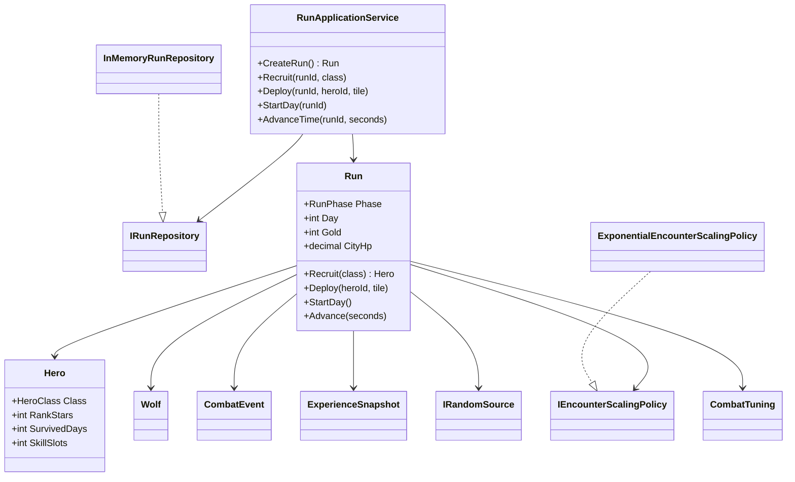

# Phase 0 core class diagram

`Run` is the transaction boundary: it accepts only legal phase-specific commands and owns battle resolution. Unity adapters should call `RunApplicationService`; they must not mutate `Hero`, `Wolf`, or battlefield state directly. Configuration, scaling, randomness, and storage are interfaces so future content, deterministic replay, and persistence can replace them without changing combat rules.
