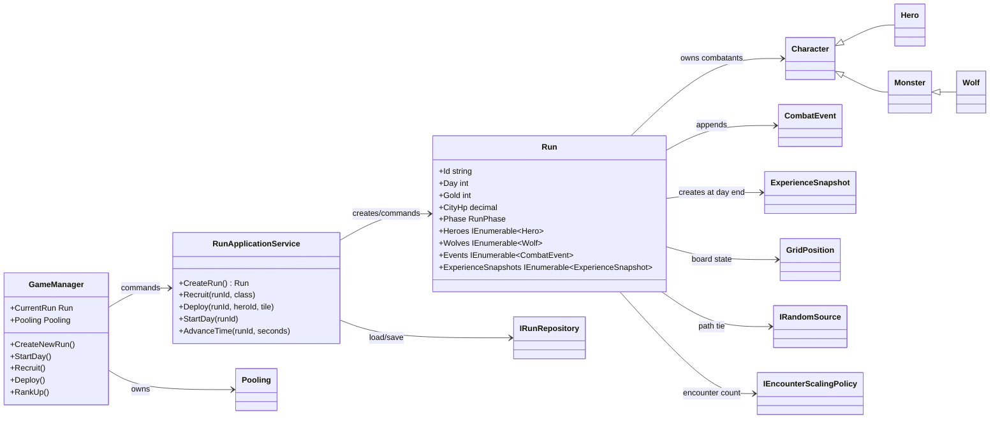
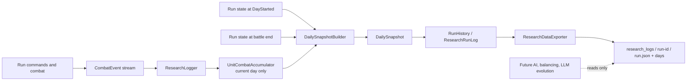
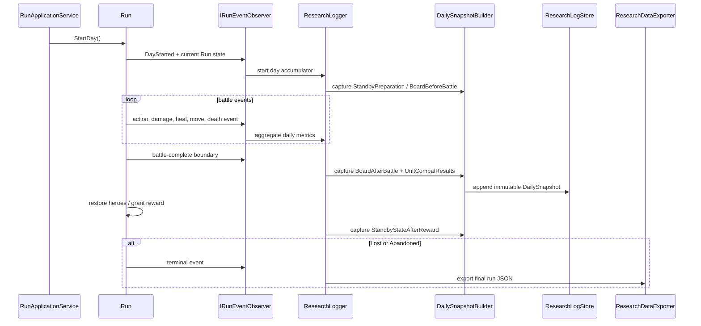

# Hero Defense — Current Architecture and Research Logging Direction

> **Status:** Phase 1 implementation มีอยู่แล้วใน codebase: run metadata/seed, observer-driven `ResearchLogger`, daily snapshot, lifetime aggregate, Abandoned closure และ Unity JSON export ถูกเพิ่มแล้ว
> ส่วน AI consumer, raw-event debug export, advanced encounter data และ future development mechanics ยังเป็น direction สำหรับงานถัดไป

## Purpose

เอกสารนี้อธิบายโครงสร้างของ Hero Defense Phase 0 ตาม code ที่มีอยู่จริง และกำหนดทิศทางสำหรับเปลี่ยนจาก `ExperienceSnapshot` แบบสรุป Hero รายวัน ไปเป็น research log ที่ตอบคำถามภายหลังได้ว่า:

- run นี้เริ่มด้วยเงื่อนไขใด และจบอย่างไร
- ก่อนสู้วันหนึ่งผู้เล่นจัดทีม, deploy, recruit หรือ rank-up อะไรบ้าง
- encounter และตำแหน่งบน board ส่งผลต่อ outcome อย่างไร
- ตัวละครแต่ละตัวทำ/รับ damage, heal, support, kill และตายเพราะอะไร
- สถิติรายวันต่างจากประวัติสะสมของตัวละครอย่างไร

เป้าหมายคือสร้างข้อมูลที่ AI, LLM-driven evolution, balancing research, profile model หรือ RL สามารถอ่านได้ภายหลัง โดย core combat ไม่ต้องรู้จัก AI เหล่านั้น

---

## 1. Current Project Structure

```text
Assets/Scripts/
├─ Core/                         Pure C# game domain; ไม่มี Unity API
│  ├─ Characters/
│  │  ├─ Character.cs
│  │  ├─ Heroes/
│  │  │  ├─ Hero.cs
│  │  │  ├─ Soldier.cs
│  │  │  ├─ Archer.cs
│  │  │  ├─ Mage.cs
│  │  │  ├─ Healer.cs
│  │  │  └─ HeroFactory.cs
│  │  └─ Monsters/
│  │     ├─ Monster.cs
│  │     └─ Wolf.cs
│  ├─ Configuration/
│  │  ├─ CombatTuning.cs
│  │  └─ ExponentialEncounterScalingPolicy.cs
│  ├─ History/
│  │  ├─ CombatEvent.cs
│  │  └─ ExperienceSnapshot.cs
│  ├─ Infrastructure/
│  │  ├─ InMemoryRunRepository.cs
│  │  └─ SystemRandomSource.cs
│  ├─ Interfaces/
│  │  ├─ IRunRepository.cs
│  │  ├─ IRandomSource.cs
│  │  └─ IEncounterScalingPolicy.cs
│  ├─ World/
│  │  └─ GridPosition.cs
│  ├─ Types.cs
│  ├─ Run.cs
│  └─ RunApplicationService.cs
├─ Game/                         Unity MonoBehaviour / presentation adapters
│  ├─ GameManager.cs
│  ├─ RunDebugView.cs
│  ├─ Characters/
│  │  ├─ CharacterView.cs
│  │  ├─ HeroView.cs
│  │  └─ MonsterView.cs
│  ├─ Pooling/
│  │  └─ Pooling.cs
│  ├─ Spawning/
│  │  └─ Spawner.cs
│  ├─ UI/
│  │  └─ HealthBarView.cs
│  └─ World/
│     └─ TileView.cs
│
Tests/HeroDefense.Core.Specs/
└─ Program.cs                    Console smoke tests linked to Core source

Docs/
├─ core-architecture.md
├─ phase-0-class-diagram.md
├─ phase-0-core-notes.md
├─ unity-adapter-setup.md
└─ research-logging-architecture.md  ← เอกสารนี้
```

### Core

| Area | Current responsibility |
| --- | --- |
| `Types.cs` | Shared enums: `RunPhase`, `HeroClass`, `EventType`, `SkillId` |
| `Characters/Character.cs` | Base combatant: immutable identity/name, HP, attack stats, cooldown state, board position, damage/heal methods |
| `Characters/Heroes/Hero.cs` | Hero class, active skill, rank stars, survival day count และ future skill slots |
| `Soldier`, `Archer`, `Mage`, `Healer` | Concrete Hero class คนละ file; stats ได้จาก `CombatTuning` |
| `HeroFactory` | สร้าง concrete hero จาก `HeroClass` เพื่อให้ `Run` ไม่ต้องผูกกับ constructor ของทุกอาชีพ |
| `Monsters/Monster.cs`, `Wolf.cs` | Monster base และ Wolf ที่มี city damage กับ movement timing |
| `Configuration/CombatTuning.cs` | Phase 0 balance: HP, normal attack, intervals และ skill definitions |
| `ExponentialEncounterScalingPolicy.cs` | จำนวน Wolf ตาม `ceil(3 × 1.3^(day-1))` และ spawn interval |
| `World/GridPosition.cs` | Value object สำหรับ board 3×3 พร้อม `CityGate` และ `SpawnGate` |
| `History/CombatEvent.cs` | Immutable append-only event ขนาดเล็ก: type, day, battle time, source, target, numeric value, detail |
| `History/ExperienceSnapshot.cs` | สรุป Hero ที่รอดและ deployed ต่อวัน: damage dealt/taken, healing, kills, casts |
| `Run.cs` | Aggregate หลัก: rule, roster, board, encounter, combat, city HP, day transition, in-memory event/snapshot list |
| `RunApplicationService.cs` | Use-case boundary สำหรับ create/recruit/deploy/undeploy/rank/start/advance แล้ว save ผ่าน repository |
| `Interfaces/` | Replaceable contracts สำหรับ repository, random source และ encounter scaling |
| `Infrastructure/` | `InMemoryRunRepository` สำหรับ session ปัจจุบัน และ unseeded `SystemRandomSource` |

### Unity Game adapters

| Class | Current responsibility |
| --- | --- |
| `GameManager` | Singleton scene entry point; สร้าง Core dependencies, current run, coroutine tick ทุก `battleTickSeconds`, public commands และ `RunChanged` event |
| `Spawner` | สร้าง grid 3×3 และ mirror deployed Hero/positioned Wolf เป็น prefab; ไม่มี targeting/pathfinding/combat rule |
| `Pooling` | Pool ที่ `GameManager` เป็นเจ้าของ; prefab แต่ละชนิดมี inactive child pool ของตนเอง |
| `TileView` | Component สำหรับ tile prefab และ grid coordinate |
| `CharacterView` | Base presentation component สำหรับ bind core `Character` เข้ากับ Unity instance |
| `HeroView`, `MonsterView` | View เฉพาะชนิดที่ bind Hero/Wolf |
| `HealthBarView` | UI adapter สำหรับ frame/fill health bar reusable |
| `RunDebugView` | แสดง core state สำหรับ debug prototype |

### Tests and documents

`Tests/HeroDefense.Core.Specs/Program.cs` เป็น console smoke test โดย link source จาก `Assets/Scripts/Core` โดยตรง ปัจจุบันครอบคลุม roster เริ่มต้น, standby-only formation/recruit, rank requirement และ empty-field encounter ที่ city รับ damage แล้วจบวันได้

เอกสารเดิมใน `Docs/` อธิบาย core architecture, class diagram, Phase 0 rule และ Unity adapter setup; เอกสารนี้ขยายเฉพาะ direction ของ history/research data

---

## 2. Current Runtime Relationship



`GameManager` เป็น **Unity GameController / composition root** ของ prototype ปัจจุบัน ส่วน `RunApplicationService` เป็น application layer ไม่ใช่ MonoBehaviour และ `Run` เป็น aggregate ที่ถือ source of truth ของ rule/state ในหนึ่ง run

---

## 3. Current Day Lifecycle

```mermaid
sequenceDiagram
participant Player
participant GM as GameManager
participant Service as RunApplicationService
participant Run
participant History as CombatEvent / ExperienceSnapshot

Player->>GM: Recruit / Deploy / Undeploy / RankUp
GM->>Service: command(runId, ...)
Service->>Run: Standby-only command
Run->>History: append command event

Player->>GM: StartDay()
GM->>Service: StartDay(runId)
Service->>Run: StartDay()
Run->>Run: reset battle clock, wolves, guard state; prepare encounter
Run->>History: DayStarted

loop every battleTickSeconds while Battle
GM->>Service: AdvanceTime(runId, seconds)
Service->>Run: Advance(seconds)
Run->>History: spawn / move / attack / cast / damage / heal / kill / death / city events
end

alt all planned wolves resolved
Run->>Run: capture existing ExperienceSnapshot for each living deployed Hero
Run->>Run: award survival day, restore HP, grant Gold, increment Day
Run->>History: DayCompleted
else CityHp becomes 0
Run->>History: CityDamaged, RunLost
Run->>Run: Phase = Lost; battle loop stops
end
```

### Phase and state rules implemented today

- `Standby` รับ recruit, deploy, undeploy และ rank-up เท่านั้น
- `StartDay` reset battle clock, current Wolves และ guard state; จำนวน Wolf มาจาก scaling policy
- `Battle` ถูก advance โดย coroutine ของ `GameManager`; core เลือก timestamp ที่มี spawn/move/action ที่ถึงเวลา
- Hero เลือก valid skill ก่อน normal attack; Wolf attack Hero tile เดียวกัน มิฉะนั้นเดินตาม shortest path ไป City; tie เลือกผ่าน `IRandomSource`
- Tile รับ Hero สูงสุด 3 และ Wolf เข้า tile ที่มี Hero ได้ไม่เกินจำนวน Hero; tile ไม่มี Hero เดินผ่านได้
- เมื่อ Wolf ถึง City Gate จะลด City HP แล้วตาย; City HP เป็น 0 ทำให้ `RunPhase.Lost`
- เมื่อ Wolf ที่ planned spawn ตาย/ผ่าน City ครบ จะจบวัน: Hero ที่รอดและ deployed ได้ survival day, full restore, Gold reward และ day เพิ่ม
- Hero ที่ตายใน field เป็น permanent death; reserve ไม่ได้ survival experience

---

## 4. Existing History Data and Its Limits

### `CombatEvent`

ปัจจุบัน event เป็น append-only record ใน memory มี:

```text
Type, Day, Time, SourceId, TargetId, Value, Detail
```

Event type ปัจจุบันครอบคลุม recruit/deploy/undeploy/rank, day start, monster spawn/move, attack, skill cast, damage/heal/kill/death, city damage, day complete และ run lost

สิ่งนี้ดีพอเป็น audit trail ขั้นแรกและเป็นแหล่งข้อมูลสำหรับ aggregation แต่ยังไม่เหมาะเป็น research schema โดยตรง เพราะ:

- ไม่มี `RunInfo`: seed, UTC time, scenario, game version หรือ schema version
- ไม่มี event publisher/observer boundary; `Run` เก็บ list โดยตรง
- damage event ไม่บอกอย่าง explicit ว่าเป็น normal attack หรือ skill ใด จึงสรุป damage by skill/normal แบบเชื่อถือไม่ได้
- ไม่มี context สำหรับ Guard owner, damage mitigated, support recipient หรือ action/death cause ที่แน่นอน
- ไม่มี board snapshot, encounter plan, room/role state หรือ reserve state ณ วันนั้น
- event อยู่ใน memory เท่านั้น และไม่มี persistence/export policy

### `ExperienceSnapshot`

ปัจจุบันสร้างตอนจบวันให้เฉพาะ Hero ที่ **ยังมีชีวิตและ deployed** แล้วเก็บ:

```text
Day, HeroId, DamageDealt, DamageTaken, HealingDone, Kills, SkillCasts
```

ข้อจำกัดสำคัญ:

- ไม่มี Hero ที่ตาย, reserve Hero, Monster หรือ City outcome
- ไม่มี HP before/after, rank, skill/stats, location, assist/support หรือ killer/death cause
- ไม่มี encounter information และไม่มี development decision ที่เกิดใน Standby
- ไม่แยก daily vs lifetime record อย่างชัดเจน
- snapshot เกิดก่อน restore HP แต่ไม่มี board-after representation ที่บอก state ทั้ง board
- ใช้ event query ตาม day ทุกครั้งและไม่มี schema/export model สำหรับ research

`ExperienceSnapshot` จะคงอยู่ใน phase migration เพื่อไม่ทำลาย behaviour เดิม แต่ไม่ใช่ canonical research source ในอนาคต

---

## 5. Target Research Logging Design



### Design principles

1. **No duplicate gameplay truth** — `Run`, `Character`, `GridPosition` และ `CombatEvent` ยังเป็น source of truth; logger อ่าน state/event และสร้าง observation copy
2. **No AI dependency** — logger ทำเพียง observe, aggregate, snapshot, store และ export; AI ไม่อยู่ใน combat core
3. **Daily immutable output** — snapshot วันจบแล้วไม่ถูกเขียนทับด้วย lifetime stat ของวันหลัง
4. **Preparation is causally visible** — action ใน Standby ถูกบันทึกเป็น preparation ของ day ที่มันมีผลจริง
5. **Structured and extensible** — field ที่ mechanic ยังไม่มีใช้ optional/empty collection แทนข้อมูลสมมติ
6. **Raw events are debug-only export** — daily snapshot เป็น canonical output; raw event export เปิดด้วย configuration flag เท่านั้น

### Proposed models

| Model | Role |
| --- | --- |
| `ResearchRunLog` | Root export object: `RunInfo`, schema version, daily snapshots, lifetime unit statistics, end reason |
| `RunInfo` | `RunId`, `Seed`, `StartedAtUtc`, `EndedAtUtc`, total completed days, scenario id, game version, data schema version |
| `DailySnapshot` | Immutable observation หนึ่ง record ต่อ battle day |
| `StandbyPreparationSnapshot` | Board state และ decisions ที่เกิดก่อนเริ่ม battle ของ day นั้น |
| `BoardSnapshot` | City state, 3×3 rooms, deployed/reserve/defeated units, HP/stats/rank/skills/positions |
| `EncounterInfo` | Planned enemy count, composition by type, waves, spawn interval, difficulty/boss fields ที่ขยายได้ |
| `UnitCombatResult` | Hero หรือ monster result รายวัน พร้อม daily stats, HP before/after, outcome และ context |
| `SupportContribution` | Source unit, target unit, action/skill id, amount, เช่น Heal หรือ Guard mitigation |
| `UnitCombatAccumulator` | In-memory aggregate ของ event สำหรับ active day; reset เมื่อ snapshot complete |
| `LifetimeUnitStatistics` | Aggregate ข้ามวันต่อ UnitId; ไม่แก้ daily snapshot เก่า |
| `DevelopmentDecision` | Recruit/deploy/undeploy/rank-up และ future point/stat/skill decisions |
| `ResearchLogger` | `IRunEventObserver` implementation ที่ update accumulator และ lifecycle capture |
| `DailySnapshotBuilder` | สร้าง DTO จาก Run state + accumulator ณ boundary ที่ถูกต้อง |
| `ResearchDataExporter` | Serialize canonical JSON และเขียนตาม storage contract |

### Daily snapshot shape

```text
DailySnapshot
├─ DayNumber
├─ StandbyPreparation
│  ├─ CapturedAtUtc
│  ├─ BoardBeforeBattle
│  └─ DevelopmentDecisions
├─ EncounterInfo
├─ UnitCombatResults[]
│  ├─ UnitId, unit kind, class/archetype, rank
│  ├─ HpBeforeBattle, HpAfterBattle, Survived
│  ├─ DamageDealt, DamageTaken, HealingDone, HealingReceived
│  ├─ Kills, Assists, NormalAttackCount, SkillUsages
│  ├─ DamageByNormal, DamageBySkill, DamageMitigated
│  ├─ SupportContributions[]
│  ├─ Position/room/role context
│  └─ KillerId / DeathCause when dead
├─ BoardAfterBattle              (ก่อน auto-heal/reward)
└─ StandbyStateAfterReward       (หลัง restore HP/reward)
```

Monster มี `UnitCombatResult` เช่นเดียวกับ Hero เพื่อศึกษาคุณภาพของ encounter แม้ Wolf ปัจจุบันไม่ได้อยู่ข้ามวัน ส่วน `LifetimeUnitStatistics` เก็บได้สำหรับทุก UnitId และมีประโยชน์มากที่สุดกับ Hero ที่ persistent ข้ามวัน

### HP timing and support attribution

- `BoardBeforeBattle` คือ state หลัง Standby decision และทันทีเมื่อ battle เริ่ม
- `BoardAfterBattle` คือ state หลัง encounter resolve แต่ **ก่อน** full restore/reward; เป็นผล combat จริง
- `StandbyStateAfterReward` เก็บ state ที่กลับสู่ Standby เพื่อเปรียบเทียบ recovery/reward
- Heal จะบันทึก source, target, amount และ `SkillId.Heal`
- Guard จะบันทึก owner ของ effect และ mitigation record เมื่อรับ damage เพื่อระบุว่าใครป้องกันใครได้เท่าใด

### Event context required for reliable aggregation

ก่อนทำ logger ต้อง enrich `CombatEvent` หรือเพิ่ม immutable action context ที่บอกได้ชัดเจนว่า event เกิดจากอะไร:

- action kind: normal attack, skill, environmental/city
- optional `SkillId` สำหรับ skill effect และ damage ที่เป็นผลของมัน
- source/target position at action time เมื่อจำเป็นต่อ room analysis
- applied damage, mitigated amount และ support-effect owner
- killer/death-cause context เมื่อ unit ตาย

การเพิ่ม context นี้ต้องไม่เปลี่ยนค่า balance, targeting, timing หรือ combat outcome

---

## 6. Proposed Integration Boundaries



`Run` จะรับรู้เพียง contract ทั่วไป เช่น `IRunEventObserver` หรือ domain event subscription; มันไม่ต้องอ้างอิง `ResearchLogger`, JSON, filesystem หรือ Unity. `RunApplicationService`/composition root เป็นผู้ประกอบ observer, clock, seed และ exporter เข้าด้วยกัน

### Run closure and reproducibility

- เพิ่ม `RunPhase.Abandoned` และ `EndRun(runId)` สำหรับผู้เล่นออก/เริ่ม run ใหม่กลางทาง
- `RunLost` และ `Abandoned` เป็น terminal reason ที่บันทึก `EndedAtUtc`
- แทน `new Random()` ที่ไม่มี seed ด้วย seed ต่อ run และ inject `IRandomSource` ที่สร้างจาก seed
- ใช้ `IRunClock`/`DateTimeOffset.UtcNow` ผ่าน adapter เพื่อให้ test ควบคุมเวลาได้
- `ScenarioId`, `GameVersion` และ `DataSchemaVersion` เป็น start configuration จาก Unity/application layer ไม่ฝังใน combat rule

### JSON layout

```text
Application.persistentDataPath/
└─ research_logs/
   └─ <run-id>/
      ├─ run.json
      └─ days/
         ├─ day-001.json
         ├─ day-002.json
         └─ ...
```

`run.json` เก็บ metadata, terminal state และ lifetime summary; `days/day-###.json` เป็น immutable daily observation. การแยก file ทำให้ append, diff, repair และอ่านบางวันง่ายกว่าเขียน JSON ก้อนใหญ่ทั้ง run ซ้ำทุกวัน

---

## 7. Safe Migration Order

1. **Document and test current behaviour** — รักษา combat smoke tests เดิมและเพิ่ม coverage ที่ต้องใช้เป็น baseline
2. **Enrich event semantics** — centralize append event, เพิ่ม action/skill/death/support context โดยไม่เปลี่ยน outcome
3. **Add run metadata and lifecycle** — seed, clock, scenario/version/schema, `Abandoned`, `EndRun`
4. **Introduce observer and accumulator** — เพิ่ม `IRunEventObserver`, `UnitCombatAccumulator` และ unit/lifetime models ใน history/research area
5. **Capture snapshot boundaries** — capture preparation at day start, battle result ก่อน restore, และ standby state หลัง reward
6. **Persist/export** — เพิ่ม `ResearchLogStore` กับ JSON exporter; default raw event export ปิด
7. **Wire Unity composition** — `GameManager` สร้าง dependencies/path provider และเรียก close/export; ไม่ย้าย combat rule ไป MonoBehaviour
8. **Future consumers only after validation** — balancing dashboard, AI observation, LLM evolution, RL หรือ CSV adapter อ่าน exported schema โดยไม่เขียนเข้า core

---

## 8. Implementation Checklist and Acceptance Tests

### Checklist

- [ ] `ResearchRunLog` มี metadata ครบและ explicit schema version
- [ ] run ใช้ deterministic seed และ test inject random/clock ได้
- [ ] one `DailySnapshot` ต่อ completed battle day
- [ ] preparation decision ถูกผูกกับ day ที่กำลังจะ battle
- [ ] board snapshot มี deployed, reserve, dead, city และทุก room state ที่เกี่ยวข้อง
- [ ] daily stat กับ lifetime stat แยก object และไม่ overwrite กัน
- [ ] damage by normal/skill และ support/mitigation attribution มาจาก explicit event context
- [ ] hero และ monster ต่างได้รับ unit result รายวัน
- [ ] raw event ไม่ถูก export default แต่เปิด debug option ได้
- [ ] Lost และ Abandoned ปิด run, set end time และ export JSON
- [ ] Core ไม่มี Unity/AI/filesystem dependency เพิ่มขึ้น

### Acceptance tests

1. Start Day 1 หลัง deploy/recruit/rank-up แล้ว `StandbyPreparation` สะท้อน roster, reserve, position, rank, stats, skills และ decision ถูกต้อง
2. Hero ใช้ normal attack, AoE skill, Heal และ Guard แล้ว result แยกจำนวน/ความเสียหายของ normal กับ skill พร้อม source-target support ได้
3. Hero/monster ตายแล้ว snapshot ระบุ HP หลัง battle, survived flag, killer และ death cause ได้; Hero ที่ตายยังมี daily record
4. จบสองวันแล้ว daily record ของ Day 1 ไม่เปลี่ยน ขณะที่ lifetime statistic ของ Hero สะสม Day 1 + Day 2
5. empty field encounter ยังคง city damage/result ถูกต้องและ snapshot จบวันถูกสร้างเพียงครั้งเดียว
6. fixed seed + fixed clock สร้าง output ที่ deterministic สำหรับ scenario เดียวกัน
7. Lost และ `EndRun`/Abandoned สร้าง terminal metadata และ JSON layout ที่กำหนด โดย raw events ไม่อยู่ใน output เมื่อ debug flag ปิด

---

## Non-goals of This Direction

- ไม่เพิ่ม numerical XP, level หรือ auto-evolution rule ใน phase นี้
- ไม่สร้าง AI, LLM prompt execution, RL policy หรือ balancing dashboard ใน logger
- ไม่เปลี่ยน combat balance, board pathing, spawn formula หรือ Unity prefab/scene เพราะเพิ่ม research data
- ไม่ใช้ CSV เป็น canonical format; CSV เป็น export adapter ภายหลังได้หากมี consumer ที่ต้องการ
